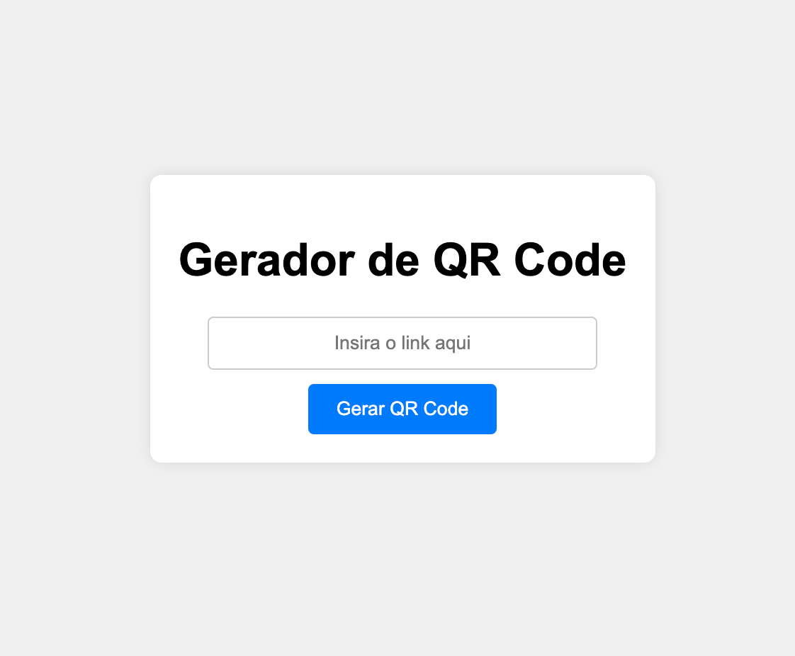
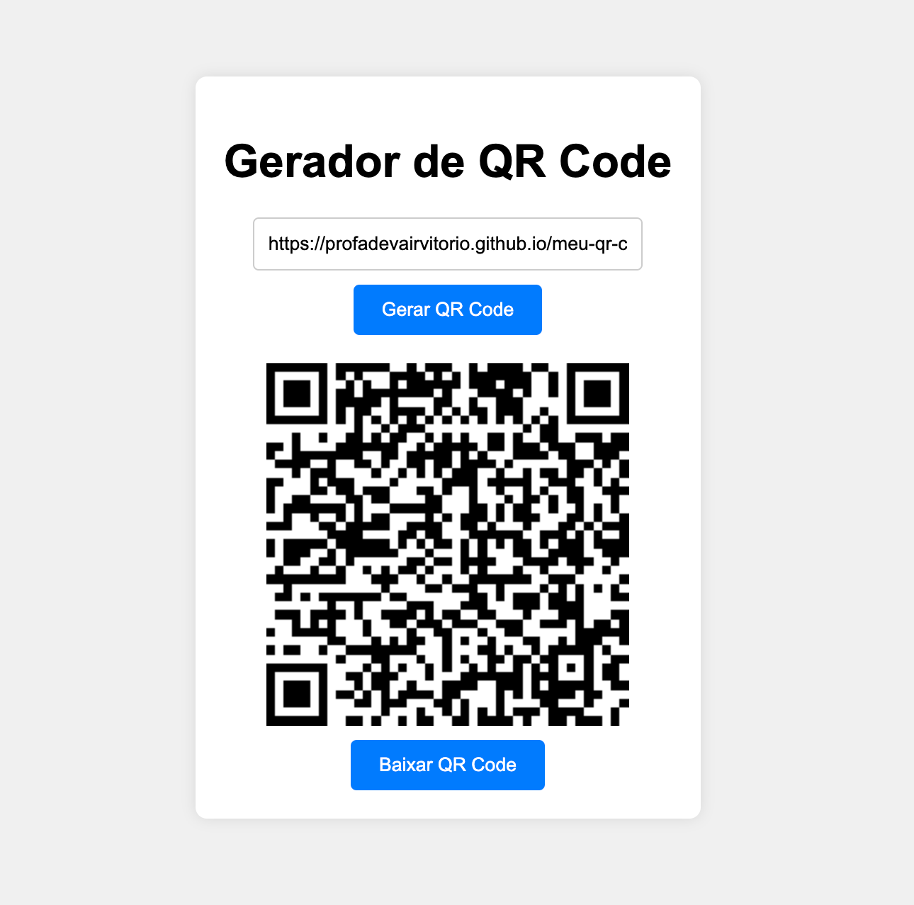

# Meu QR Code

Um simples gerador de QR Code usando HTML, CSS e JavaScript. Este projeto permite que o usuário insira um link e gere um QR Code que pode ser visualizado e baixado.

Link: https://profadevairvitorio.github.io/meu-qr-code/ 




## Visão Geral

Este projeto foi criado para demonstrar como gerar QR Codes dinamicamente no navegador, sem a necessidade de instalação de bibliotecas adicionais. A interface é minimalista e fácil de usar.


## Funcionalidades

- Entrada de URL para gerar o QR Code.
- Exibição do QR Code gerado.
- Opção para baixar o QR Code como imagem.

## Tecnologias Utilizadas

- HTML
- CSS
- JavaScript
- [QRCode.js](https://cdnjs.cloudflare.com/ajax/libs/qrcodejs/1.0.0/qrcode.min.js) (CDN)

## Como Usar

1. Clone este repositório:

```bash
git clone https://github.com/seu-usuario/meu-qr-code.git
```

2. Navegue até o diretório do projeto:
```bash
cd meu-qr-code
```
   
3. Abra o arquivo index.html no seu navegador preferido.

## Estrutura do Projeto

```bash
meu-qr-code/
├── index.html
├── style.css
└── script.js
```

## Contribuição
Se você deseja contribuir com este projeto, por favor, siga os passos abaixo:

```bash
- Fork este repositório.
- Crie um branch para sua feature (git checkout -b feature/nova-feature).
- Commit suas alterações (git commit -m 'Adicionei uma nova feature').
- Push para o branch (git push origin feature/nova-feature).
- Abra um Pull Request.
```

## Licença
```bash
MIT License

Copyright (c) 2024 profadevairvitorio

Permission is hereby granted, free of charge, to any person obtaining a copy
of this software and associated documentation files (the "Software"), to deal
in the Software without restriction, including without limitation the rights
to use, copy, modify, merge, publish, distribute, sublicense, and/or sell
copies of the Software, and to permit persons to whom the Software is
furnished to do so, subject to the following conditions:

The above copyright notice and this permission notice shall be included in all
copies or substantial portions of the Software.

THE SOFTWARE IS PROVIDED "AS IS", WITHOUT WARRANTY OF ANY KIND, EXPRESS OR
IMPLIED, INCLUDING BUT NOT LIMITED TO THE WARRANTIES OF MERCHANTABILITY,
FITNESS FOR A PARTICULAR PURPOSE AND NONINFRINGEMENT. IN NO EVENT SHALL THE
AUTHORS OR COPYRIGHT HOLDERS BE LIABLE FOR ANY CLAIM, DAMAGES OR OTHER
LIABILITY, WHETHER IN AN ACTION OF CONTRACT, TORT OR OTHERWISE, ARISING FROM,
OUT OF OR IN CONNECTION WITH THE SOFTWARE OR THE USE OR OTHER DEALINGS IN THE
SOFTWARE.
```